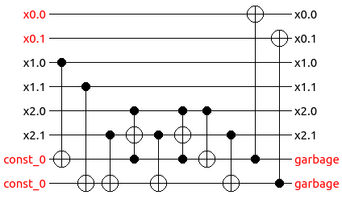
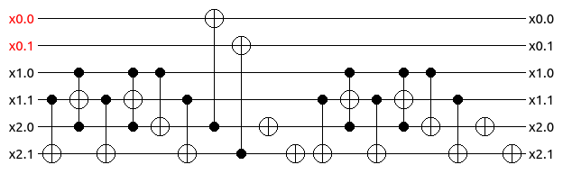

Description and Features
========================

The *SyReC Synthesizer* allows users to automatically synthesize reversible circuits from a high-level HDL description. The proposed tool accepts any HDL description (example circuits (.src files) are available in test/circuits directory) following the SyReC grammar and syntax as described in detail in :cite:p:`wille2016syrec`. The tool provides an easy-to-use GUI with which the user can specify any preferred functionality. As an example, consider the SyReC program for a simple 2-bit Adder as shown in the figure below.

.. image:: "images/guiAdder.png"
   :width: 600

   SyReC Adder program along with the provided GUI.

.. |PlayButtton| image:: images/build.png
  :width: 30

.. |CostButtton| image:: images/stat.png
  :width: 30

This Adder computes the sum of the inputs x1 and x2 and stores the result in the output signal x0. By clicking on the |PlayButtton| button, the tool automatically synthesizes the corresponding circuit. To this end, two complementary synthesis schemes
are available:

1. *Cost-aware synthesis*:
In this synthesis scheme, additional circuit lines (representing circuit signals) are introduced to store the corresponding intermediate results of each operation—thereby providing the liberty to accordingly modify the circuit without having any effect on the original inputs (for more details, refer :cite:p:`wille2010syrec` and :cite:p:`wille2016syrec`). This results in a circuit description where the gate costs are kept moderate at the expense of a substantially larger number of additionally needed circuit lines. Figure below depicts the circuit which results when synthesizing the SyReC Adder program.

   Adder circuit resulting from cost-aware synthesis..

2. *Line-aware synthesis*:
This synthesis scheme aims to the keep the number of additional circuit lines as small as possible. To achieve this, the corresponding intermediate results of each operation are computed and stored using one of the available circuit lines (rather than additional circuit lines). Afterwards, the inputs are re-computed with the help of the corresponding inverse operations (for more details, refer :cite:p:`wille2019towardsHDLsynthesis`). Figure below depicts the circuit which results when synthesizing the SyReC Adder description using the line-aware scheme.

   Adder circuit resulting from cost-aware synthesis..

Furthermore, the tool allows to simulate the resulting circuit (By clicking on the |SimButtton| button) as well as to determine the gate costs of it (By clicking on the |CostButtton| button).
